# Installation Guide — Windows

Step-by-step guide to install and use **My Translator** on Windows 10/11.

---

## Requirements

- Windows 10 or later (x64 or ARM64)
- [Soniox](https://soniox.com) API key (pay-per-use, ~$0.12/hour)

---

## Step 1 — Download

Download the latest `.exe` installer from: [**Releases**](https://github.com/phuc-nt/my-translator/releases/latest)

Choose the right version:
- **x64** — Most Windows PCs (Intel/AMD)  
- **arm64** — Windows on ARM (Surface Pro X, Snapdragon laptops)

---

## Step 2 — Bypass SmartScreen

> ⚠️ The app is not yet signed with a certificate. Windows SmartScreen will block it on first run.

When you see the **"Windows protected your PC"** screen:

1. Click **"More info"**

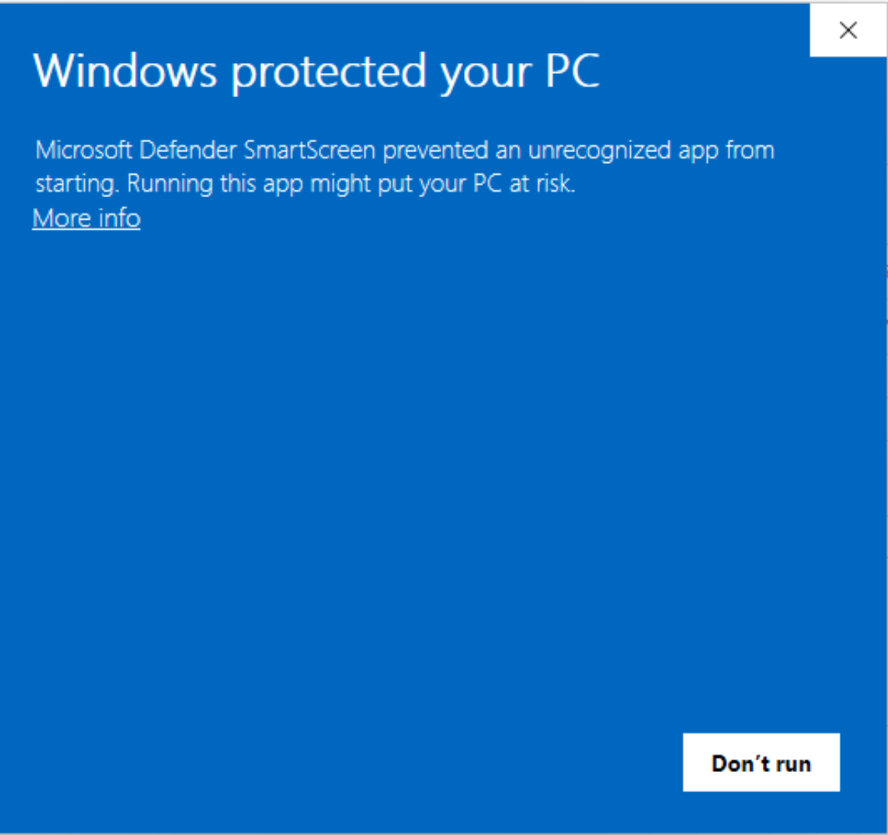

2. Click **"Run anyway"**

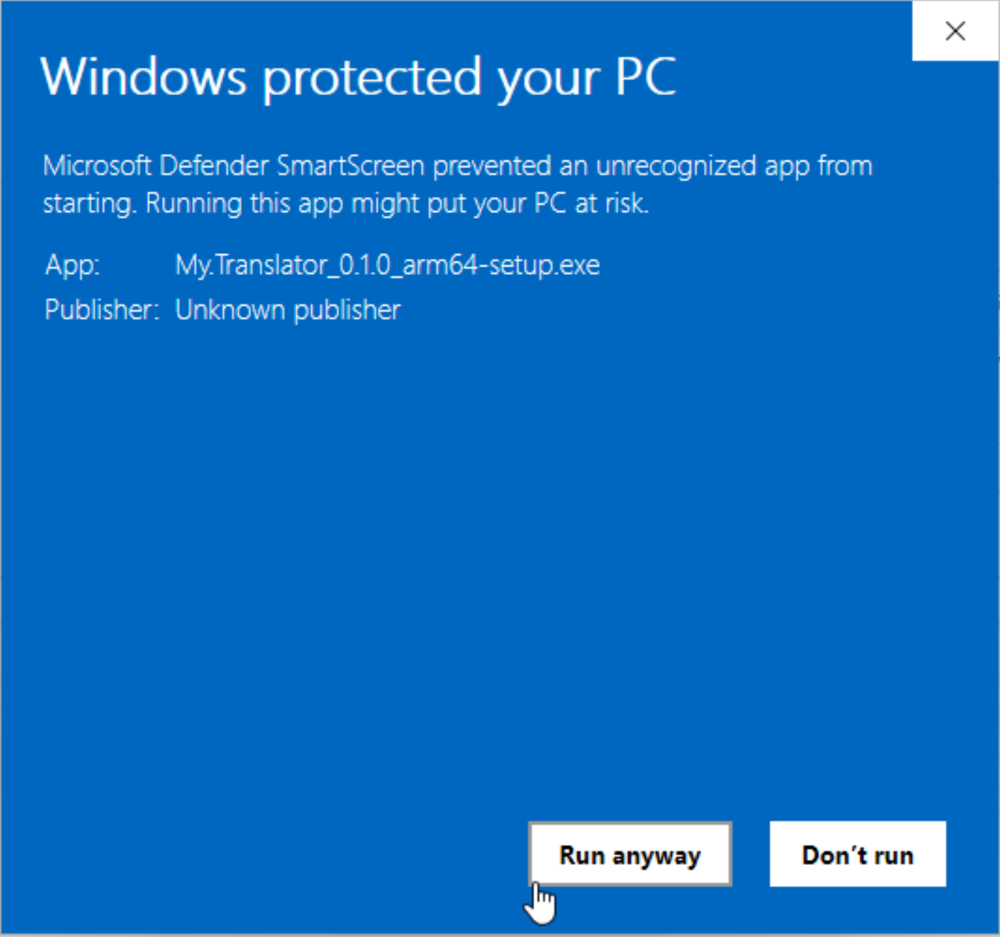

---

## Step 3 — Install

The setup wizard will guide you:

1. Click **Next** to start

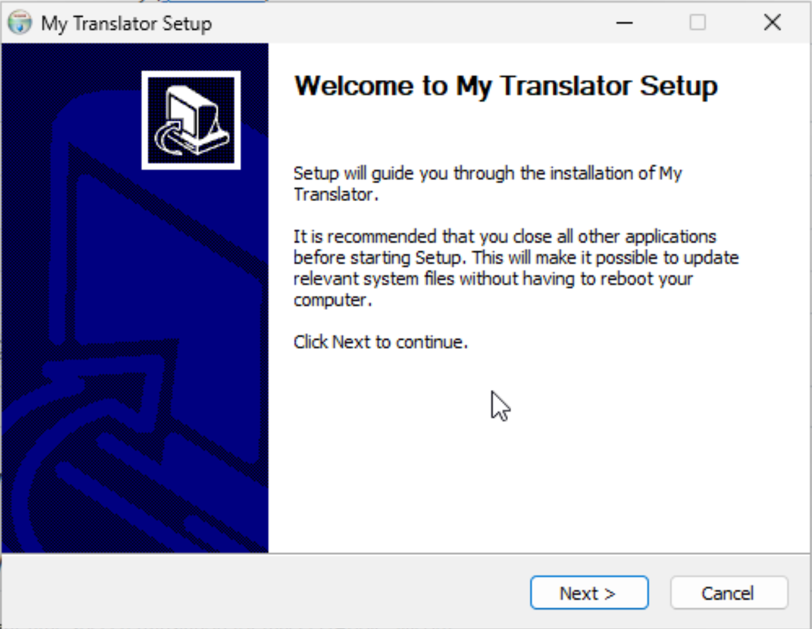

2. Choose install location (default is fine) → click **Next**

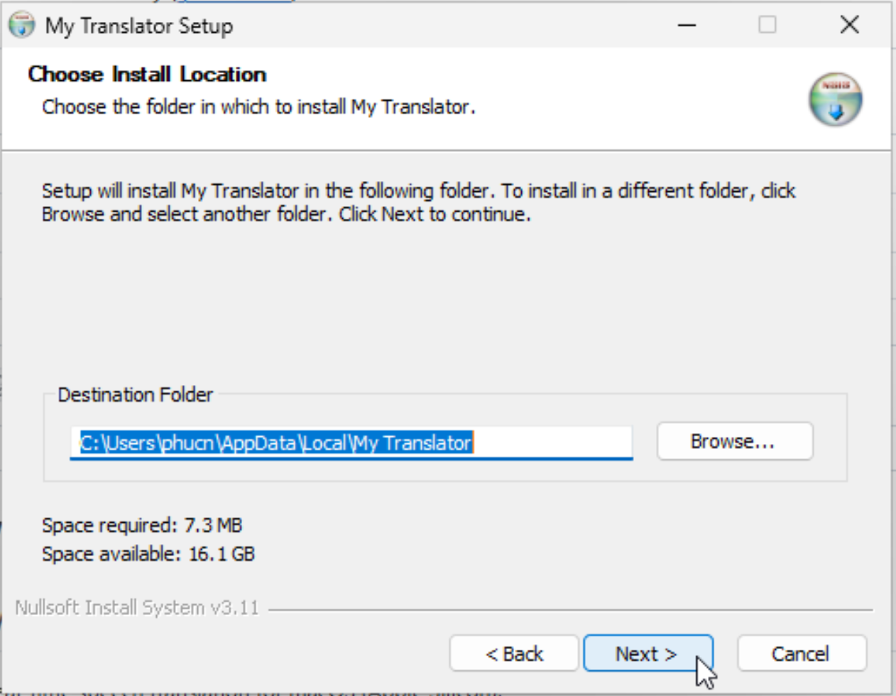

3. Wait for installation to complete → click **Next**

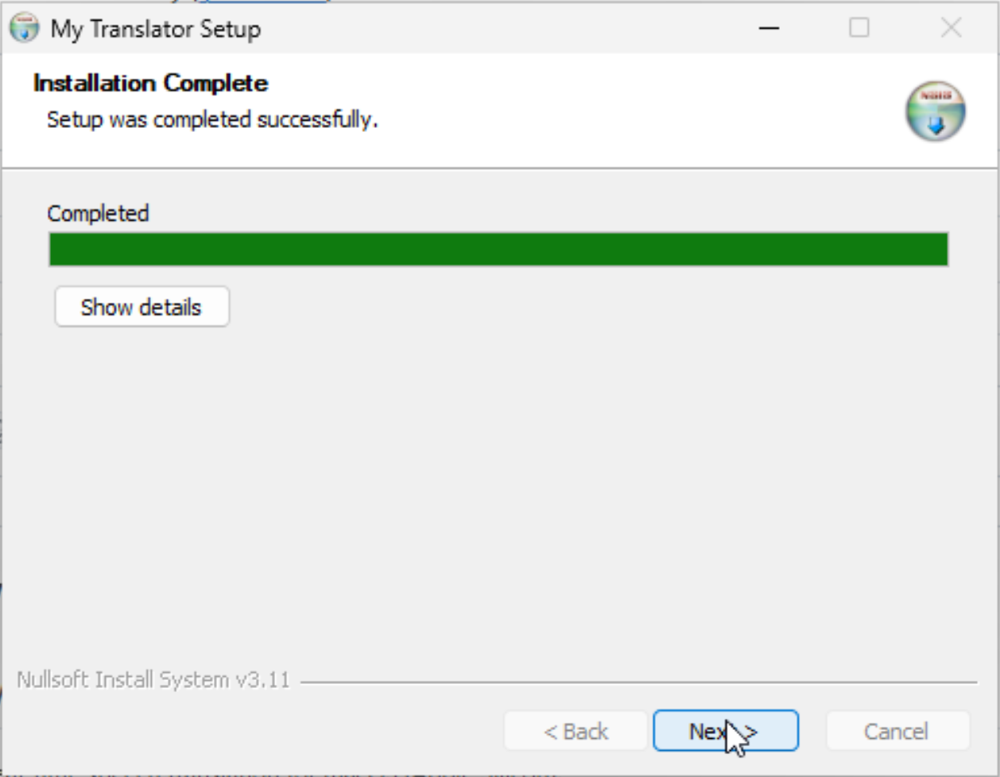

4. Check **"Run My Translator"** → click **Finish**

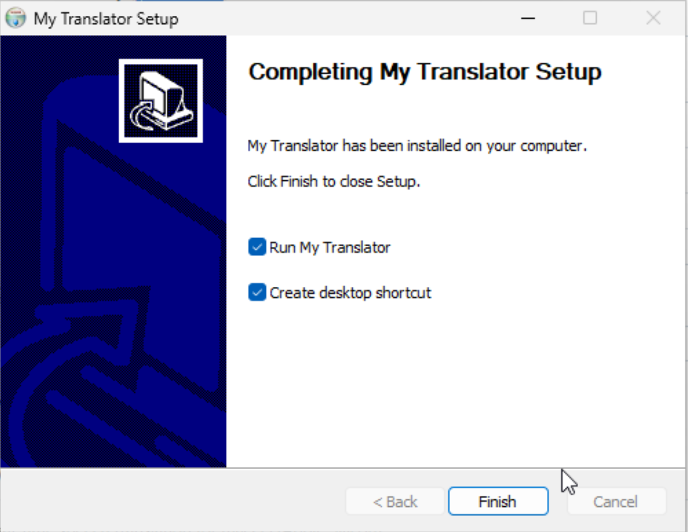

---

## Step 4 — Configure API Key & Languages

The app opens. Click ⚙️ to open **Settings**:

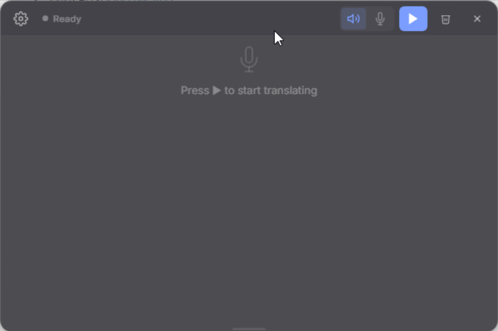

Configure:

1. **SONIOX API KEY** — Paste your API key from [console.soniox.com](https://console.soniox.com)
2. **Source** — Choose the source language (or leave as Auto-detect)
3. **Target** — Choose the target language (e.g., Vietnamese, English...)
4. **Audio Source** — Choose System Audio (computer sound) or Microphone

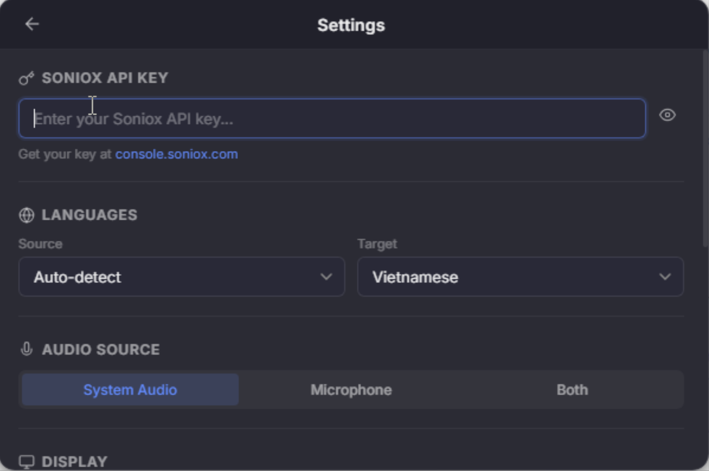

Scroll down for more options:

- **Font Size** — Adjust text size
- **Max Lines** — How many lines to show
- **Show original text** — Display source text alongside translation
- **Custom Context** — Add domain/terms for better accuracy

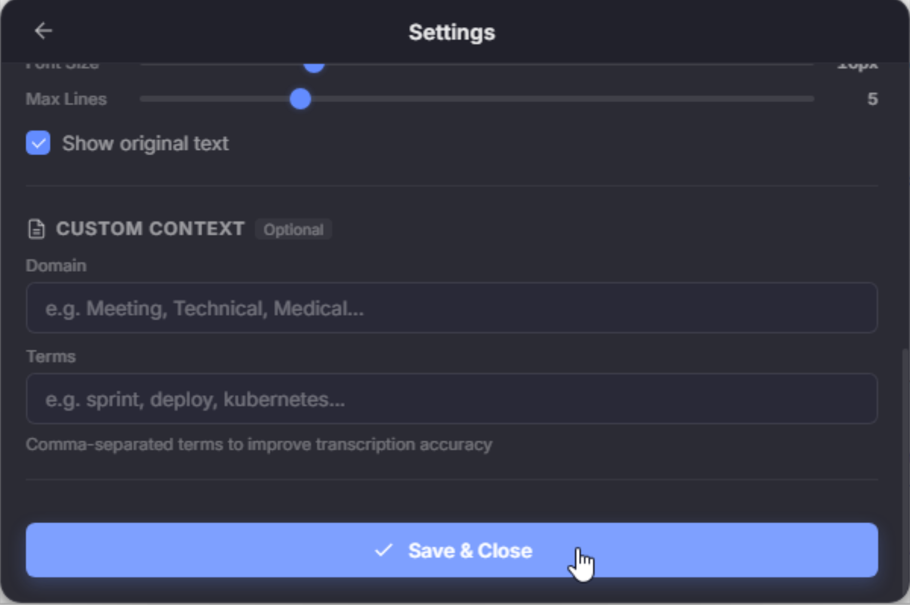

Click **Save & Close** when done.

> 💡 **Where to get an API key?**
> 1. Go to [soniox.com](https://soniox.com) → create an account
> 2. Go to Dashboard → copy your API key

---

## Step 5 — Start Translating!

Click ▶ to start. The app will show **Listening...**

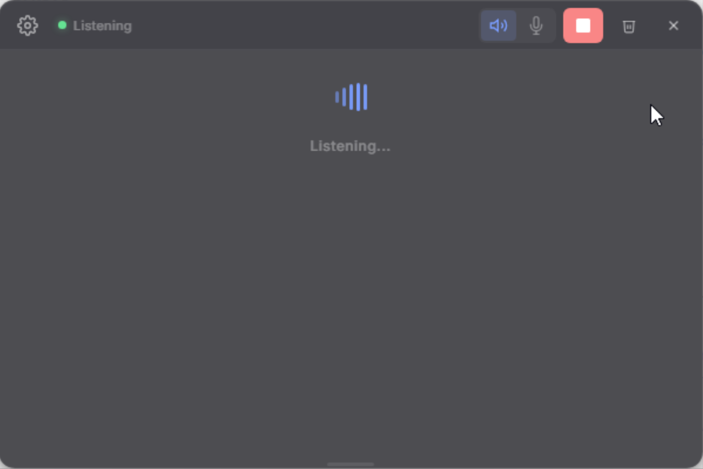

Now play any audio on your PC (YouTube, Zoom, podcasts...) and translations appear in real-time!

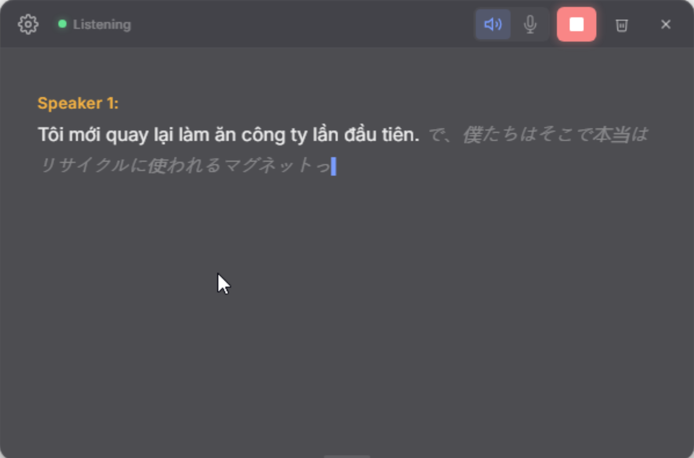

---

## Tips

- **System Audio** captures whatever is playing on your PC — no virtual cable needed
- **Microphone** captures live speech from your mic
- The app works as an **overlay** — drag it anywhere, resize as needed
- Translations are **saved automatically** — click 📋 to view the transcript file

---

## Keyboard Shortcuts

| Shortcut | Action |
|----------|--------|
| `Ctrl+Enter` | Start / Stop |
| `Ctrl+,` | Open Settings |
| `Esc` | Close Settings |

---

## Troubleshooting

### SmartScreen blocks the installer
→ Click **"More info"** → **"Run anyway"** (see Step 2).

### No translation text appears
→ Check that your Soniox API key is correct in Settings (⚙️).

### No system audio captured
→ Make sure audio is playing on your PC. Some apps use exclusive audio mode — try a different source.

### App doesn't start
→ Make sure WebView2 Runtime is installed. It comes with Windows 10/11, but on older versions you may need to install it from [Microsoft](https://developer.microsoft.com/en-us/microsoft-edge/webview2/).
